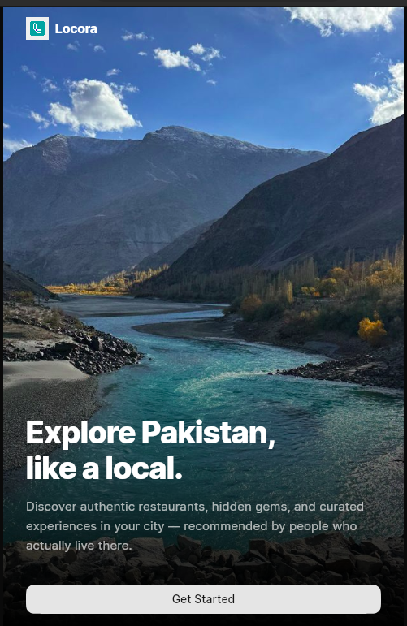
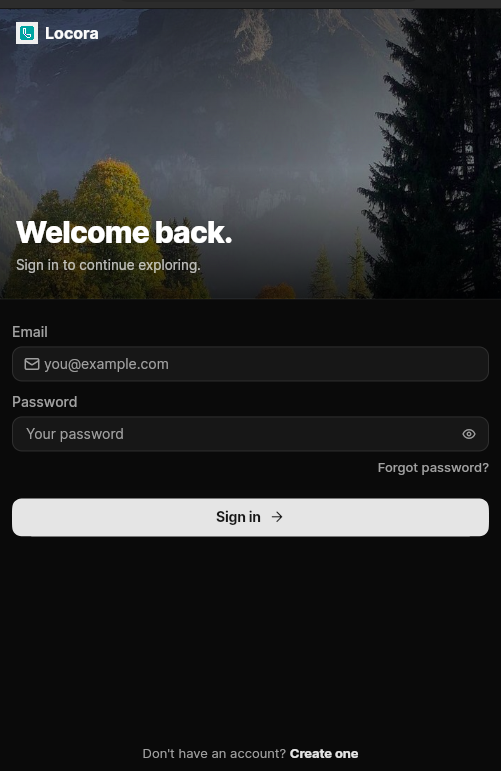
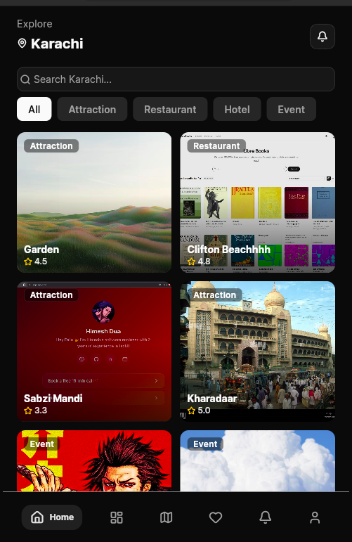
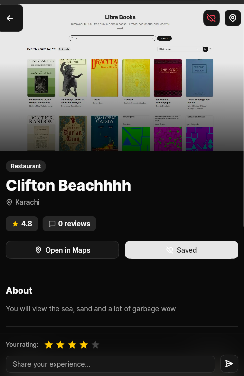
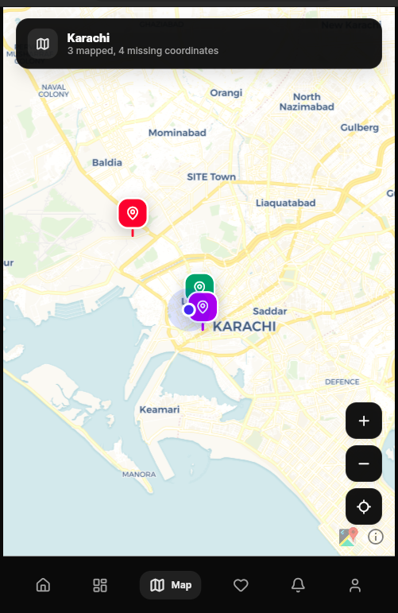

# Locora — City Guide Mobile Application

**eProject Documentation**

---

## Team Members

| Student ID    | Name                |
|---------------|---------------------|
| Student1605338 | HIMESH              |
| Student1557185 | MUHAMMAD DANIYAL    |
| Student1598122 | SHEHERYAR MUSHTAQ   |
| Student1573040 | AYAN HASSAN         |
| Student1577060 | MUHAMMAD ANAS       |

---

## Index

1. Introduction
2. Objectives
3. Problem Statement
4. Functional Requirements Coverage
5. Non-Functional Requirements Coverage
6. Project Screenshots
7. Hardware / Software Requirements

---

## 1. Introduction

**Locora** is a cross-platform city guide mobile application built using **Flutter** and **Firebase**. It is designed to help both residents and tourists discover the most authentic and curated experiences within a city — including popular attractions, restaurants, hotels, and events.

The project is inspired by the modern travel discovery experience and follows the eProject methodology recommended by Aptech — a step-by-step, real-life implementation of concepts taught in class. Locora brings together everything from authentication, real-time databases, location services, mapping, and content management into one unified application.

The current release focuses on **Pakistan** as its first launch region, with **Karachi** as the flagship city. The architecture is built to scale to additional cities and countries with minimal changes.

---

## 2. Objectives

The primary objectives of the Locora project are:

- To build a real-life, production-grade mobile application that simulates an industry-style project flow.
- To provide users with a single platform to **discover, explore, and review** city attractions.
- To allow **admins** to manage attractions, events, and content dynamically through an in-app dashboard.
- To demonstrate practical use of **Flutter, Firebase, Cloudinary, and OpenStreetMap** in a real-world scenario.
- To apply **best UI/UX practices** for a modern, dark-themed, mobile-first experience.
- To produce well-structured, scalable, and maintainable code with proper documentation.

---

## 3. Problem Statement

Tourists and even local residents often struggle to find reliable, organized, and up-to-date information about places to visit, eat, or stay within a city. Existing solutions are either fragmented (separate apps for hotels, food, events), cluttered with advertisements, or do not focus on local cultural authenticity.

**Locora** solves this by offering:

- A **single curated platform** to browse attractions, restaurants, hotels, and events.
- **Verified user reviews and ratings** to help users make informed decisions.
- **Integrated maps and directions** so users never get lost.
- **Personalized favorites** so users can save places they care about.
- An **admin-controlled catalog** ensuring the data shown is moderated and accurate.

---

## 4. Functional Requirements Coverage

The following table maps each Aptech functional requirement to its implementation in Locora.

### 4.1 User Registration and Authentication
- Users can create accounts via **Email/Password** or **Google Sign-In** (Firebase Authentication).
- Secure login flow with session persistence using `firebase_auth`.
- Password reset option is available from the login screen.
- Implemented in: [lib/screens/auth/register.dart](lib/screens/auth/register.dart), [lib/screens/auth/login.dart](lib/screens/auth/login.dart)

### 4.2 City Selection
- Users select their city during onboarding/setup.
- City data (description, image, region) is stored in [lib/data/cities.dart](lib/data/cities.dart).
- Implemented in: [lib/screens/essentials/setup_screen.dart](lib/screens/essentials/setup_screen.dart)

### 4.3 Attraction Listings
- The home tab displays a grid of attractions, restaurants, hotels, and events for the selected city.
- Users can **filter by category** (All / Attraction / Restaurant / Hotel / Event).
- Each card shows: name, cover image, category, and star rating.
- Implemented in: [lib/screens/essentials/tabs/home_tab.dart](lib/screens/essentials/tabs/home_tab.dart)

### 4.4 Detailed Information
- Tapping a listing opens a detailed view with cover image, description, category, location, rating, reviews, and an "Open in Maps" link.
- Implemented in: [lib/screens/city/detailed_attraction_card.dart](lib/screens/city/detailed_attraction_card.dart)

### 4.5 Maps and Directions
- Integrated **OpenStreetMap** via `flutter_map` shows all attractions of the selected city as colored markers.
- Users can tap a marker to view details and use `url_launcher` to open external map applications for directions.
- Implemented in: [lib/screens/essentials/tabs/map_tab.dart](lib/screens/essentials/tabs/map_tab.dart)

### 4.6 User Reviews and Ratings
- Logged-in users can post a **text review with a star rating** on any attraction.
- Reviews are stored in Cloud Firestore and rendered in real-time.
- Implemented in: [lib/widgets/reviews/](lib/widgets/reviews/)

### 4.7 Search Functionality
- A search bar on the home tab lets users search attractions by name.
- Combined with category filters for refined results.
- Implemented in: [lib/screens/essentials/tabs/home_tab.dart](lib/screens/essentials/tabs/home_tab.dart)

### 4.8 User Profile and Preferences
- Users can view and edit their profile, including name, avatar (Cloudinary upload), and city preference.
- A dedicated **Favorites** tab lets users revisit saved places.
- Implemented in: [lib/screens/essentials/tabs/profile_tab.dart](lib/screens/essentials/tabs/profile_tab.dart), [lib/screens/essentials/tabs/favorites_tab.dart](lib/screens/essentials/tabs/favorites_tab.dart)

### 4.9 Admin Dashboard
- An in-app **Admin Dashboard** (role-protected) lets admins add, edit, and remove attractions and events.
- Implemented in: [lib/screens/admin/dashboard.dart](lib/screens/admin/dashboard.dart), [lib/screens/admin/manage_places.dart](lib/screens/admin/manage_places.dart)

---

## 5. Non-Functional Requirements Coverage

| Requirement      | How Locora Implements It                                                                 |
|------------------|------------------------------------------------------------------------------------------|
| Responsiveness   | Asynchronous Firestore streams keep UI updates under 1–2 seconds.                        |
| Loading Time     | Flutter Splash + cached network images (`cached_network_image`) for fast initial paint.  |
| User Interface   | Built using **ForUI** + custom dark theme for a modern, consistent design language.      |
| Accessibility    | Legible typography, high-contrast dark mode, large touch targets.                        |
| User-friendly    | Bottom navigation, clear iconography (`hugeicons`), guided onboarding flow.              |
| Operability      | Stateless widgets where possible; minimal rebuilds for performance.                      |
| Error Handling   | Try/catch blocks around all Firebase calls with user-facing snack-bar messages.          |
| Scalability      | Firestore backend scales horizontally; city-based data partitioning ready for expansion. |
| Security         | Firebase Auth + Firestore security rules restrict writes to authenticated users.         |
| Documentation    | This file + inline code comments + README.                                               |

---

## 6. Project Screenshots

### 6.1 Onboarding Screen
The welcome screen introduces the user to Locora's value proposition: exploring Pakistan like a local.

---

### 6.2 Login / Authentication
A clean, dark-themed sign-in screen with email/password and Google Sign-In support.

---

### 6.3 Home — Attraction Listings
The main browse screen showing categorized cards (Attractions, Restaurants, Hotels, Events) with search and filters for the selected city (Karachi).

---

### 6.4 Attraction Detail Screen
Tapping a listing shows full details — gallery, description, rating, review composer, "Open in Maps", and Save-to-Favorites.

---

### 6.5 Interactive Map View
All attractions in the selected city plotted on an integrated map with color-coded category markers.

---

## 7. Hardware / Software Requirements

### Hardware
- A modern development laptop or desktop (Intel i5 / Ryzen 5 or above recommended)
- **8 GB RAM** minimum (16 GB recommended for Flutter + Android emulator)
- **10 GB** free disk space for Flutter SDK, Android SDK, and emulators
- Android device or emulator (API 21 / Android 5.0+) for testing
- iOS device or Mac with Xcode (optional, for iOS builds)

### Software
- **Flutter SDK** `^3.11.4`
- **Dart** (bundled with Flutter)
- **Android Studio** or **VS Code** with Flutter & Dart extensions
- **Firebase CLI** for backend deployment
- **Git** for version control

### Key Packages Used
| Package | Purpose |
|---------|---------|
| `firebase_core`, `firebase_auth`, `cloud_firestore` | Backend, authentication & database |
| `google_sign_in` | Social authentication |
| `cloudinary_public` | Image upload & hosting |
| `flutter_map`, `latlong2` | OpenStreetMap-based map view |
| `geolocator` | Current-location services |
| `cached_network_image` | Optimized image loading |
| `forui`, `flex_color_scheme` | UI design system & theming |
| `hugeicons` | Icon library |
| `url_launcher` | External navigation (maps, websites) |
| `shared_preferences` | Local persistence |
| `image_picker` | Profile / place image selection |

---

**End of Document**
